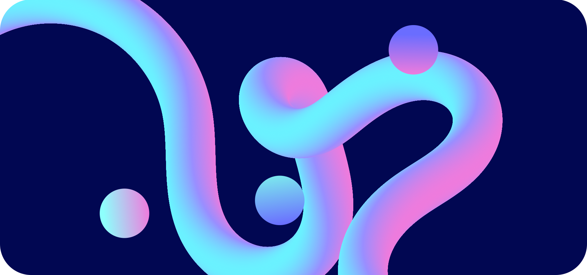

# Meenbeese

Hi, I am Meenbeese. I am an aspiring developer and student from Canada! 👋  
Psst... Do you like the banner above? Yes, I do as well. You can just copy it if you want.

## 💪 Skills

### 😃 Good knowledge

       
### 🤔 Some knowledge

      

### 🧐 Planning to learn

    ) 

## ☎️ Contact Me

- **✉️ Email**: [meenbeese@tutanota.com](meenbeese@tutanota.com)
- **🗨️ Matrix**: [@ceesaw:matrix.org](https://matrix.to/#/@ceesaw:matrix.org)
- **🐘 Mastodon**: [@foobar@mastodon.social](https://mastodon.social/@foobar)
- **🐈‍⬛ GitHub**: [@meenbeese](https://github.com/meenbeese)
- **🗻 GitLab**: [@meenbeese](https://gitlab.com/meenbeese)

## 🟢 Activities

Currently, I am working on creating my first Android app using Kotlin/Java.  

I also many hobbies like reading, and listening to podcasts and walking around   
the city. Yes, the computer screen can indeed be consuming sometimes :)
